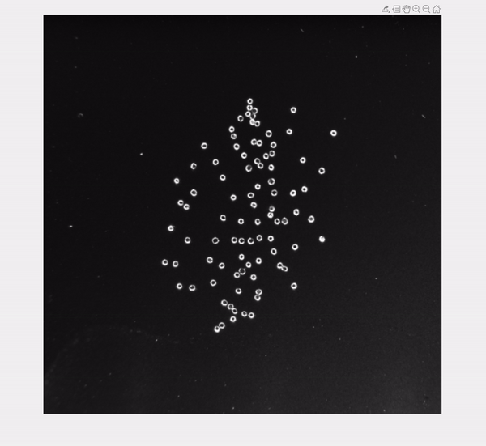

The code analyzes the spatially nonlinear motion of particles (see Fig. 4A and Fig. S6 of the paper).

Run "plot_path_to_displacement_ratio.m" to compute and plot the ratios of the distance traveled to the displacement magnitude.

**Raw assembly result** | **Assembly result with tracked particles**
------ | ------
 |  
