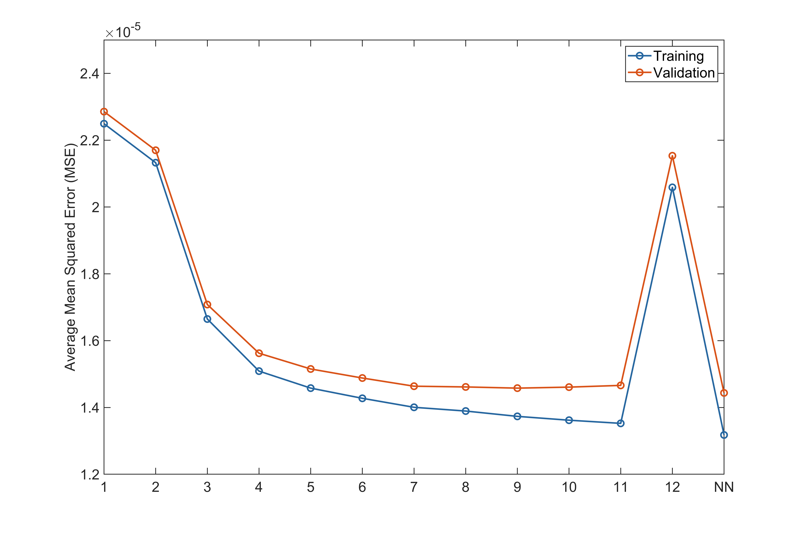

 

The code fits neural networks (NNs) and polynomials to the PTV data (see Fig. S1 and S2 of the paper).

1. Run calculate_MSE_training.m and calculate_MSE_validation.m (in Data analysis) to fit NNs and polynomials to the traning/validation data
2. Run plot_MSEs.m to visualize the MSE losses
