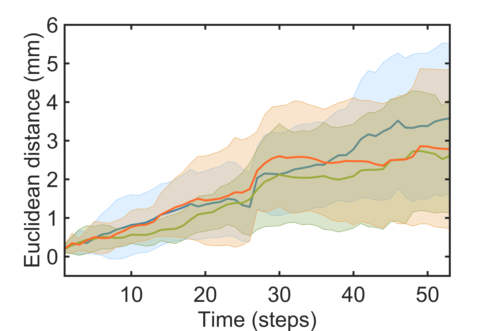

The code analyzes the stochasticity of the particle motion.

 

1. Download the data from https://zenodo.org/record/7977043 (Stochastic motion) into the current folder
2. Run plot_error_dynamics.m to compute and plot the position difference between the particle pairs (see Fig. 4B of the paper)
3. Run plot_all_steps.m to plot the trails of individual particle pairs (see Fig. S7 of the paper)
4. Run lyapunov_exp.m to compute and plot the Lyapunov exponents (see Fig. S8 of the paper)
