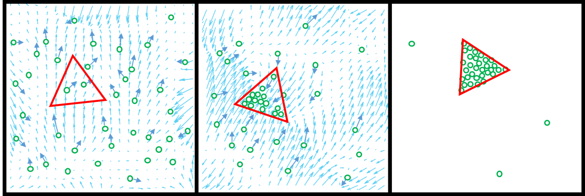

# Programmable assembly of particles on a Chladni plate
Artur Kopitca, Kourosh Latifi, Quan Zhou, Science Advances 2021, doi: [10.1126/sciadv.abi7716](https://www.science.org/doi/pdf/10.1126/sciadv.abi7716)

If you find this code useful, please consider citing:
```
@article{kopitca2021programmable,
  title={Programmable assembly of particles on a Chladni plate},
  author={Kopitca, Artur and Latifi, Kourosh and Zhou, Quan},
  journal={Science advances},
  volume={7},
  number={39},
  pages={eabi7716},
  year={2021},
  publisher={American Association for the Advancement of Science}
}
```
## Concept

 

The paper proposes the particle assembly method applied to a Chladni plate. The method includes:
1. Training neural networks (NNs) predicting the likely particle displacement on the plate as follows,
```math
\Delta \hat{\mathbf{p}} = u_n(\mathbf{p}),
```
where $u_n$ is an NN, $n$ is the index of vibration frequency (1-30 kHz), and $\mathbf{p}$ is the particle position on the plate.

2. Solving the problem of aligning two sets of points, particles and shape-defining targets,
```math
\arg \min_{\mathbf{R},\mathbf{v},n} \frac{1}{N}\sum\limits_{i=1}^N \lVert \mathbf{R} \mathbf{t}_i + \mathbf{v} - E_{n}(\mathbf{p}_i) \rVert^2 ,
```
where $E_{n}(\mathbf{p}) = \mathbf{p} + u_n(\mathbf{p})$ is the expected particle position after executing $n$,  $\mathbf{R}$ is a rotation matrix, $\mathbf{t}$ is a shape-defining target, $\mathbf{v}$ is a translation vector, and $N$ is the number of particles and targets.

The proposed assembly algorithm iteratively minimizes the above-stated objective function by applying a combination of optimization techniques and model-predictive control. See the paper for more details.

## Results
All results can be found in Supplementary Materials of the paper and https://zenodo.org/record/7977043.

**Experiment** | **Simulation**
------ | ------
 |  

## Requirements
### Hardware
1. Chladni plate (50 mm × 50 mm × 0.525 mm, silicon)
2. Camera (ImperX/IGV-B1621C-KC000 with Infinity/InfiniMite Alpha lens)
3. Piezoelectric actuator (Piezomechanik/PSt, 150/2 × 3/2)
4. Amplifier (Piezosystems/EPA-104-230)
5. D/A converter (National Instruments/USB-6363)
6. Dual-axis goniometer (Thorlabs, GN2/M)
### Software
1. MATLAB R2020b
2. Server used to operate the camera and D/A converter (not included here)

## Usage
1.	[Algorithm](https://github.com/ArtKop/AcoShape/tree/main/Algorithm) contains the code of the Assembly algorithm (see the pseudocode in Materials and Methods of the paper).
2.	[Simulator](https://github.com/ArtKop/AcoShape/tree/main/Simulator)	contains the simulated version of the algorithm (no hardware/software is required except for MATLAB).
3.	[Data processing/Chladni figures](https://github.com/ArtKop/AcoShape/tree/main/Data%20processing/Chladni%20figures) contains the code for computing & plotting the Chladni figures and NNs (see Fig. S1 of the paper).
4.	[Data processing/Nonlinear motion](https://github.com/ArtKop/AcoShape/tree/main/Data%20processing/Nonlinear%20motion) contains the code for analyzing the nonlinearity of the particle motion (see Fig. 4A and S6 of the paper).
6.	[Data processing/Stochastic motion](https://github.com/ArtKop/AcoShape/tree/main/Data%20processing/Stochastic%20motion) contains the code for analyzing the stochasticity of the particle motion (see Fig. 4B, S7, and S8 of the paper).
